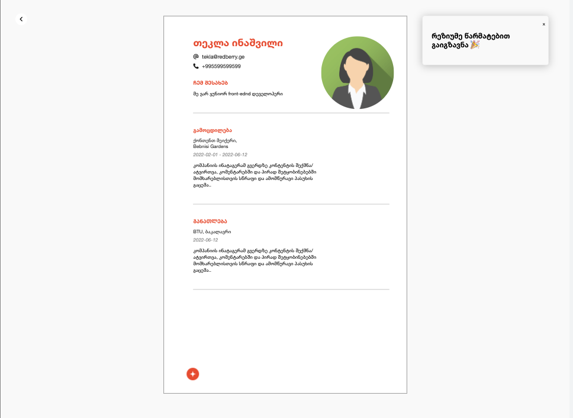

# Resume
# Redberry bootcamp challenge solution

## Table of contents

- [Overview](#overview)
  - [The challenge](#the-challenge)
  - [Screenshots](#screenshots)
  - [Links](#links)
- [My process](#my-process)
  - [Built with](#built-with)
- [Author](#author)

## Overview

### The challenge

Create a simple resume maker.
A user should be able to input general information, experiences and education and create resume based on inputted data. 
You can see the resume page updating automatically as user fills the input forms.
Enterred data should not be lost when refreshed

The design should be completed on one resolutions:
- Desktop (1920x1080)

### Screenshots

### Links

- Solution URL: [GitHub](https://github.com/tekla900/redberry-bootcamp)
- Live Site URL: [GitHub Pages](https://tekla900.github.io/redberry-bootcamp/)

## My process

### Built with

- Vanilla JS
- Semantic HTML5 markup
- CSS custom properties
- CSS Flexbox
- LocalStorage
- Fetch API

## Author

- GitHub - [Tekla Inashvili](https://github.com/tekla900)
- LinkedIn - [Tekla Inashvili](https://www.linkedin.com/in/tekla-inashvili-b95594232/)